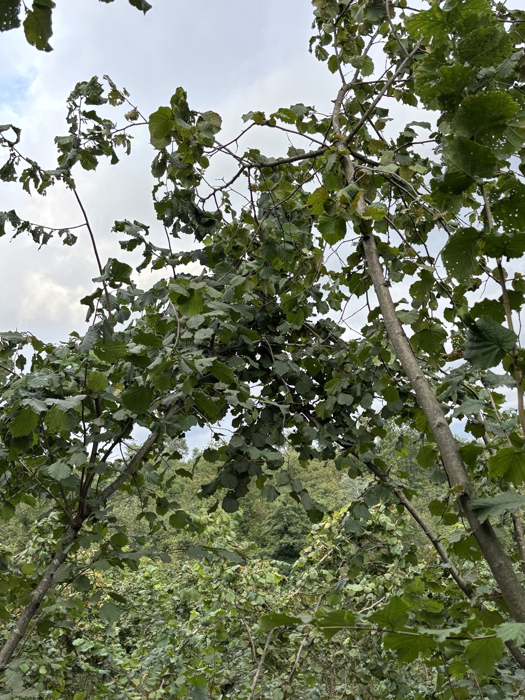
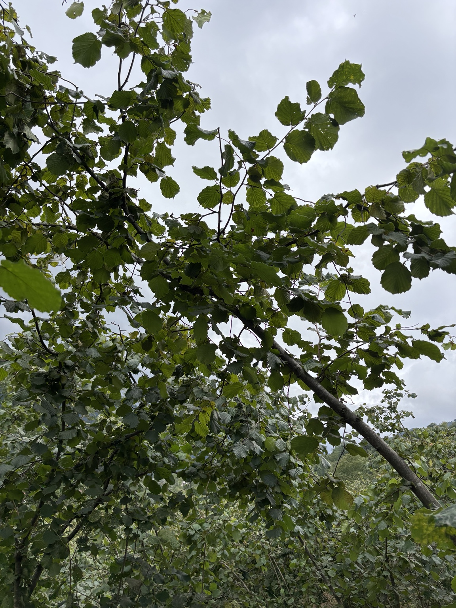
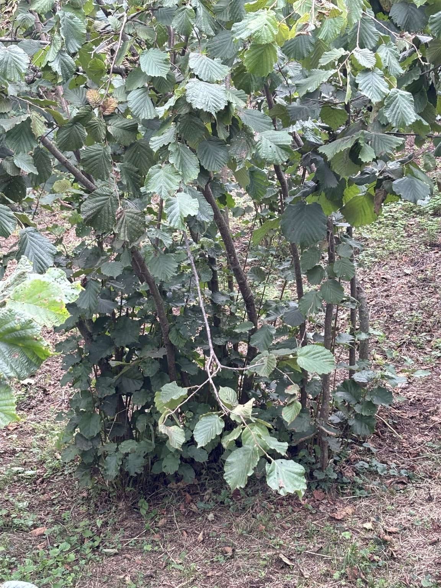
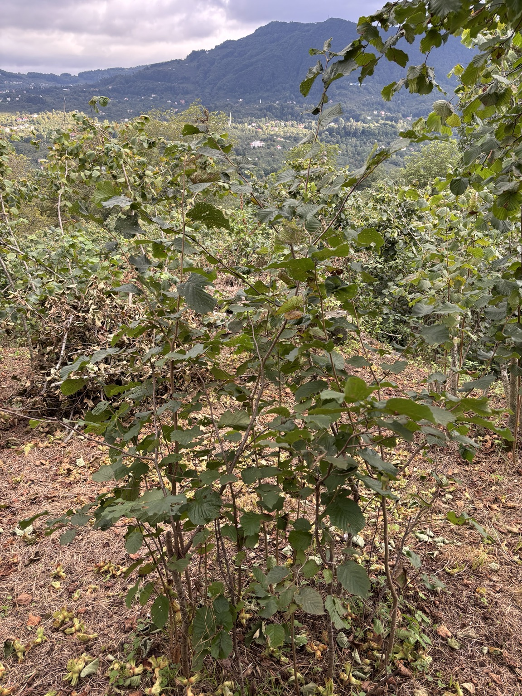
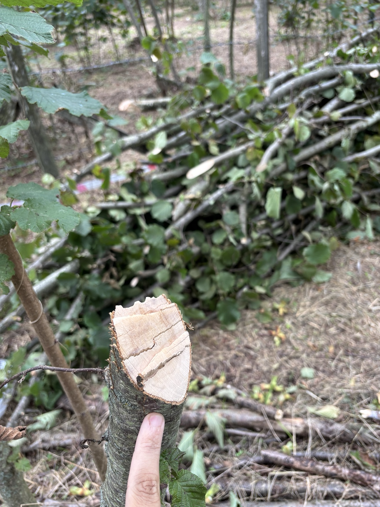
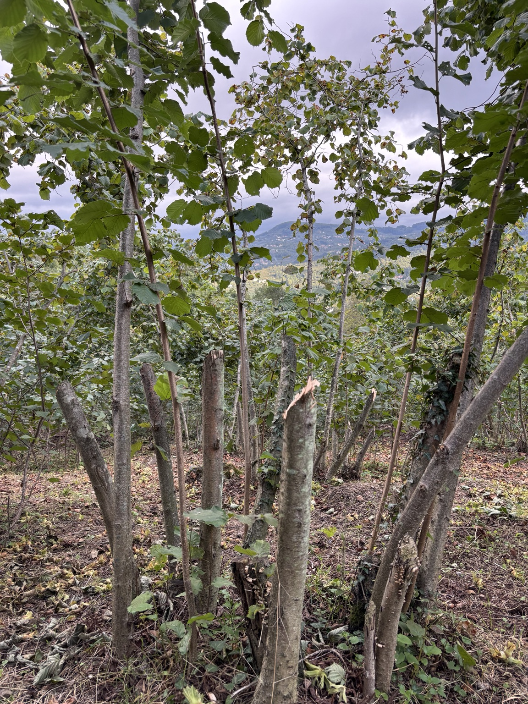
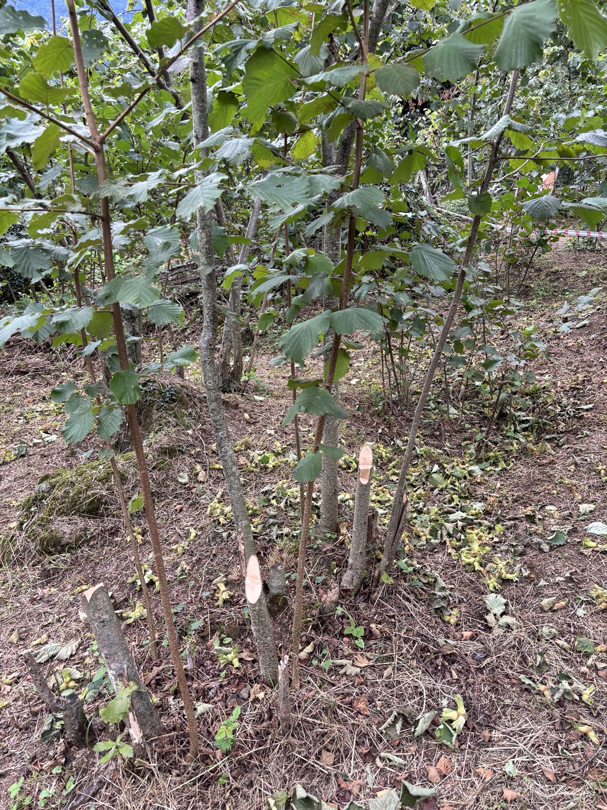
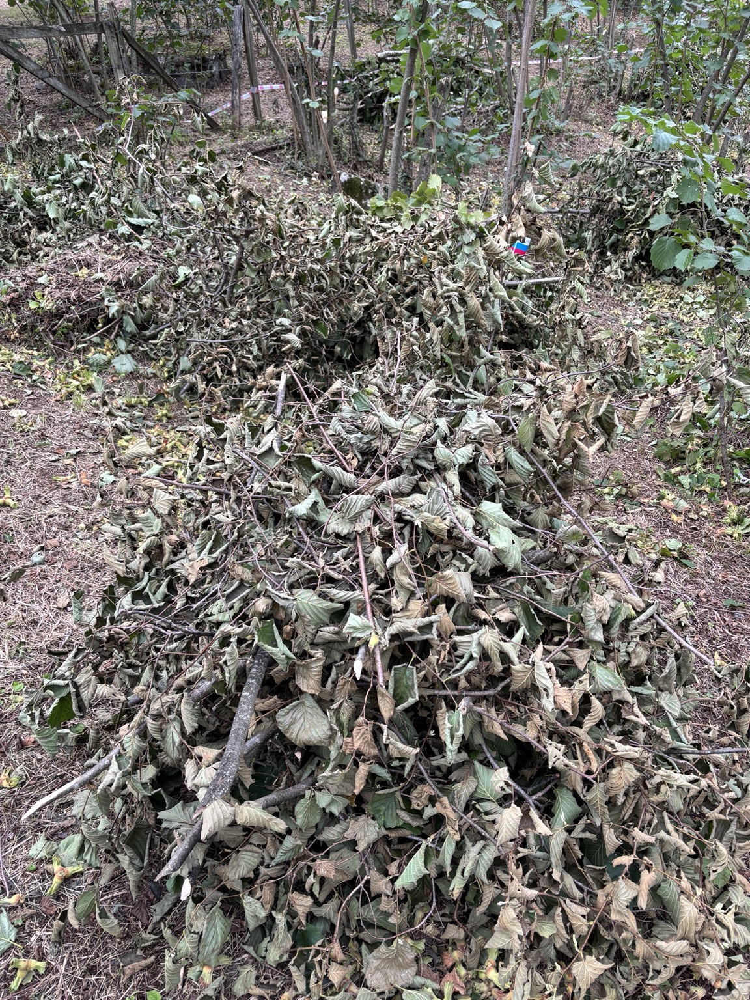

# Hazelnut Orchard Process Improvement

### A Real-World Business Analysis & Process Improvement Case Study

**Business Analysis | Process Improvement | Operational Resilience | Phased Transition**

---

## Project Overview

This project documents a real-world process improvement case from my family's hazelnut orchard in Ordu, Türkiye.

The orchard originally consisted entirely of **Yağlı Palaz**, a local hazelnut cultivar known for its strong, thick, and widely spreading branches. While the cultivar produces a high-quality and flavorful hazelnut, its physical structure creates a demanding harvesting process. Mature branches often require multiple people to bend them, and branches from neighboring clusters can overlap and interfere with each other, creating additional coordination and repeated work during harvesting.

Approximately five years ago, my family began a gradual transition toward **Göğ Fındık**, locally also known as **Geç Fındık**. New Göğ Fındık clusters were planted in the open spaces between the existing Yağlı Palaz clusters rather than replacing them immediately.

The primary objective of this transition is **not to maximize production or revenue**. The goal is to create an orchard that is easier and safer to harvest, requires less physical effort, and remains manageable even when only one person is available.

Instead of removing the existing cultivar all at once, the orchard is being transformed gradually. Mature Yağlı Palaz stems are selectively removed while younger and medium-aged productive stems remain in place. This allows current production to continue while creating more sunlight and physical space for the developing Göğ Fındık clusters.

The transition is expected to take approximately ten years, although the final replacement point will depend on the actual maturity and development of the new plants.

> **The objective is not simply to replace one hazelnut cultivar with another, but to manage the transition while maintaining current production, reducing harvesting difficulty, supporting new growth, and improving the long-term operational sustainability of the orchard.**

---

## Case Study Scope

This repository is a **field-based Business Analysis and Process Improvement case study**, not a quantitative agricultural research study.

The analysis is based on:

- direct participation in the harvesting process,
- long-term family experience with the orchard,
- field observations
-  domain knowledge provided by the primary decision-maker,
- and photographic evidence collected during the current transition process.

No numerical performance improvements are claimed unless they were directly observed or measured.
  ---

## Background & Change Drivers

The orchard has been part of my family for generations. It was originally managed by my grandfather as a source of livelihood and was later divided among the next generation of the family. As the family moved away from full-time agricultural work, our portion of the orchard gradually became less of a commercial operation and more of a seasonal family activity connected to our roots in Ordu.

Today, our family lives primarily in Istanbul and spends approximately 20 days each year in Ordu during the hazelnut harvest period. The orchard still produces several hundred kilograms of hazelnuts annually, but maximizing agricultural income is not the main objective. The priority is to preserve the land, continue the family tradition, and make the harvesting process sustainable for the future.

### Why was a change needed?

The existing orchard consisted entirely of **Yağlı Palaz**. Although it produces a highly valued and flavorful hazelnut, its harvesting characteristics create several long-term operational challenges:

- mature stems become thick and physically demanding to bend,
- large branches spread laterally and can overlap with neighboring hazelnut clusters,
- harvesting often requires two physically capable people to manipulate a single branch,
- branch interference creates additional coordination and repeated work,
- and the process becomes increasingly dependent on multiple family members being available at the same time.

This dependency became especially important when considering the family's future availability.

As the younger family members move into full-time professional careers, being available for the entire harvest period every year cannot be guaranteed. At the same time, the orchard should remain manageable without requiring the presence of several physically capable people.

The challenge was therefore not simply agricultural.

It was an **operational sustainability problem**:

> **How can the orchard remain harvestable and enjoyable as a family activity even if fewer people are available in the future?**

### Why Göğ Fındık?

Approximately five years ago, the family decided to begin introducing **Göğ Fındık (Geç Fındık)** into the orchard.

Göğ Fındık is already widely grown in the local area and has physical characteristics that better match the family's future harvesting requirements:

- shorter and thinner stems,
- more upright growth,
- less lateral branch expansion,
- lower probability of interference between neighboring clusters,
- significantly easier branch handling,
- and the possibility for a single person to harvest independently.

The decision therefore represents a deliberate trade-off.

Yağlı Palaz is preferred for its richer flavor, while Göğ Fındık provides a substantially more manageable harvesting structure and generally strong productivity.

For this orchard, **long-term operability and harvesting accessibility were prioritized over preserving the existing cultivar solely for its taste advantage.**

### Primary Change Drivers

| Change Driver | Operational Meaning |
|---|---|
| **Physical workload** | Reduce the force required to access and manipulate branches during harvesting |
| **Coordination complexity** | Reduce interference between branches and the need to reposition neighboring stems |
| **Family labor dependency** | Avoid making the harvest dependent on several family members being available simultaneously |
| **Operational resilience** | Keep the orchard manageable even in a scenario where only one person is available |
| **Long-term continuity** | Preserve the orchard as a sustainable and enjoyable family activity for future years |
- domain knowledge provided by the primary decision-maker,
- and photographic evidence collected during the current transition process.
  ---

## AS-IS Process Analysis

Before the transition is completed, harvesting is still largely performed on the original Yağlı Palaz clusters.

A typical harvesting cycle begins by selecting one cluster and deciding which branch should be handled first. Branches are generally approached one by one, but the process is rarely independent because the size and lateral spread of Yağlı Palaz branches cause them to occupy the same working space as branches from neighboring clusters.

### Current Harvesting Flow

1. Select a hazelnut cluster.
2. Identify the branch to be harvested.
3. Evaluate its thickness, direction, and interference with surrounding branches.
4. Reposition neighboring branches when necessary.
5. Two people bend medium or mature Yağlı Palaz branches downward.
6. After the initial bending force is applied, the branch can usually be held in position with less effort.
7. Hazelnuts are picked manually and dropped onto the ground.
8. The process is repeated for the remaining branches.
9. Hazelnuts are collected from the ground and transferred into sacks.

The main inefficiency is concentrated **before and during branch positioning**, rather than in picking the hazelnuts themselves.

### Pain Point 1 — Branch Interference

Large Yağlı Palaz branches grow not only upward but also laterally. As neighboring clusters develop, their branches can overlap and occupy the same working space.

This creates a dependency between otherwise separate harvesting tasks.

A branch may be ready to harvest, but another branch from a neighboring cluster may first need to be moved. If the branch becomes trapped during bending, the operation has to be stopped, partially reversed, and reorganized before harvesting can continue.



*Branches from neighboring clusters can overlap in the same working space, creating coordination overhead and repeated work during harvesting.*

This creates a recurring **rework loop**:

`Select branch → attempt to bend → interference occurs → release branch → reposition surrounding branches → attempt again`

The physical effort is significant, but the coordination required to determine which branches must be moved and in what order can create an even greater operational burden.

### Pain Point 2 — High Physical Workload

Even medium-aged Yağlı Palaz branches can require two physically capable people to perform the initial bending operation.

Younger stems may sometimes be handled by one person, but only when surrounding branches do not interfere. Mature stems are considerably more difficult to manipulate independently.

This means that the harvesting process is not only labor-intensive but also structurally dependent on the simultaneous availability of multiple people.

### Pain Point 3 — Dense Canopy and Limited Growing Space

The mature Yağlı Palaz structure creates a dense canopy because of its height, lateral branch expansion, and leaf volume.



*The mature Yağlı Palaz canopy occupies significant vertical and lateral space, limiting open sky exposure beneath the existing orchard structure.*

As the newly planted Göğ Fındık clusters continue to grow, sufficient sunlight and physical space become increasingly important.

### Reference — Untreated Dense Cluster

The following image shows a nearby untreated hazelnut cluster used only as a visual reference for the type of density that can develop when mature stems remain in place.



*Reference example from a neighboring orchard. This image is not presented as a before-photo of the project area.*

### Core AS-IS Problem

The current process creates three interconnected dependencies:

**High branch density → Branch interference → Coordination and rework**

**Thick mature stems → High physical effort → Multi-person labor dependency**

**Dense canopy → Reduced open space and sunlight → Constraint on new cultivar development**

The result is a harvesting system that works under the current family structure but becomes increasingly difficult to sustain if fewer physically capable people are available in the future.
---

## TO-BE Process & Target State

The target state is an orchard dominated by **Göğ Fındık**, where harvesting can be performed with significantly lower physical effort and much less coordination between neighboring branches.

Unlike Yağlı Palaz, Göğ Fındık grows with shorter, thinner, and more upright stems. Its branches occupy less lateral space and are therefore far less likely to interfere with neighboring clusters.



*Young Göğ Fındık clusters were planted in the open spaces between the original Yağlı Palaz clusters as part of the long-term replacement strategy.*

### Target Harvesting Flow

1. Select a hazelnut cluster.
2. Identify the branch to be harvested.
3. Access the branch directly or bend it with minimal force if necessary.
4. Harvest the hazelnuts without first repositioning multiple surrounding branches.
5. Move to the next branch independently.
6. Repeat the process across the cluster.

Because the branch structure is expected to be easier to manage, the harvesting process can potentially be simplified further by collecting directly into a container instead of first dropping the hazelnuts onto the ground.

### AS-IS vs TO-BE

| Process Dimension | AS-IS: Yağlı Palaz | TO-BE: Göğ Fındık |
|---|---|---|
| **Branch structure** | Thick, long, laterally expanding | Thin, shorter, more upright |
| **Cross-cluster interference** | Frequent | Expected to be minimal |
| **Initial bending effort** | High | Low |
| **Typical labor requirement** | Often two people for one branch | One person can work independently |
| **Coordination requirement** | High | Low |
| **Rework caused by interference** | Recurring | Expected to be limited |
| **Independent harvesting** | Difficult | Feasible |
| **Operational dependency** | Multiple physically capable people | Significantly reduced |

### Target Operating Principle

The objective is **not to reduce family participation**.

The objective is to eliminate the condition where multiple people must be present for the harvest to remain operational.

> **Three people should make the work faster and easier — but one person should still be able to complete the harvest independently if necessary.**

This creates a more resilient operating model.

If all family members are available, the harvest becomes easier.

If only two people are available, the process remains manageable.

If only one person is available, the process may take longer, but it should still remain operational.

### Target Outcome

The final state is a fully transitioned Göğ Fındık orchard where:

- branch interference is no longer a major harvesting constraint,
- high-force branch bending is no longer a normal requirement,
- individual harvesting tasks can be performed independently,
- dependence on simultaneous family labor is reduced,
- and the orchard remains manageable even under the least favorable labor-availability scenario.

This is the core definition of **operational resilience** for the project.

---

## Transition Strategy & Decision Criteria

The orchard is not being converted through an immediate replacement.

Instead, the transition follows a **phased and selective approach**.

New Göğ Fındık clusters were planted in the open spaces between the existing Yağlı Palaz clusters. During the early years, only limited thinning was necessary because the new plants were still small.

As the Göğ Fındık clusters entered a more important growth stage, their need for sunlight and physical space increased. This made selective removal of mature Yağlı Palaz stems progressively more important.

### Why not remove all Yağlı Palaz at once?

Removing the existing cultivar immediately would create unnecessary transition risk.

The Göğ Fındık plants require several years to develop sufficient size and productivity. Eliminating the entire Yağlı Palaz structure before the new system is ready would reduce current production without providing an immediate operational replacement.

The transition therefore balances two competing risks:

**Removing too much too early**
→ current productive capacity is lost before the new cultivar is ready.

**Removing too little for too long**
→ mature Yağlı Palaz stems continue to restrict sunlight, physical space, and harvesting accessibility.

The strategy is to remain between these two extremes.

> **Maintain enough of the existing system to support current production, while removing enough of it to allow the new system to develop successfully.**

### Stem Removal Decision Criteria

Stem removal is not random and is not based solely on age.

The primary decision-maker evaluates mature Yağlı Palaz stems using the following priorities:

| Priority | Decision Criterion | Effect on Removal Decision |
|---|---|---|
| **1** | Sunlight obstruction | Stems that significantly shade developing Göğ Fındık clusters receive the highest removal priority |
| **2** | Thickness and bending difficulty | Thick mature stems that require high physical effort are more likely to be removed |
| **3** | Branch interference | Stems that frequently collide or overlap with surrounding branches increase removal priority |
| **4** | Age / lifecycle stage | Older stems are generally more suitable for removal as younger productive stems remain available |
| **5** | Current hazelnut quantity | Not a primary decision factor |

### Example — Mature Stem Selected for Removal



*Example of a mature and thick Yağlı Palaz stem selected for removal during the current transition process.*

Current production on a mature stem does not automatically justify keeping it.

The harvested hazelnuts on removed stems can still be collected during the same season, while medium-aged stems continue to provide production during the remaining transition period.

### Selective Thinning

The objective is not to remove every existing stem.

It is to remove the stems that create the greatest operational and developmental constraints while retaining younger and medium-aged productive stems.



*Selective thinning in practice: mature stems have been removed while thinner and younger stems remain in place.*

This allows the orchard to maintain a temporary production layer while gradually transferring space and operational importance to the new Göğ Fındık clusters.

### Current Transition State



*Example of a Yağlı Palaz cluster after selective thinning. Several mature stems have been removed while productive younger stems remain.*

The transition is expected to take approximately ten years in total, but the final replacement point is not determined by the calendar alone.

The true completion trigger is:

> **The Göğ Fındık clusters reaching sufficient maturity to take over the productive and operational role of the existing Yağlı Palaz orchard.**

For this reason, the transition is best described as:

**Time-informed, but maturity-driven.**

---

## Stakeholders & Business Requirements

The orchard transformation is primarily a family decision supported by long-term local agricultural experience.

### Stakeholder Roles

| Stakeholder | Role | Main Interest |
|---|---|---|
| **Primary decision-maker** | Process Owner & Domain Expert | Long-term sustainability of the orchard and correct cultivar management |
| **Family harvest participants** | Operational Stakeholders | Lower physical workload, less coordination complexity, and easier harvesting |
| **Experienced local growers and family network** | Informal Knowledge Sources | Sharing practical knowledge about cultivar behavior, maintenance, and local conditions |

The primary decision-maker has the strongest domain knowledge because of long-term experience with the orchard and the local growing environment. Other family members participate directly in harvesting and therefore experience the operational difficulties of the current process.

The project translates these practical needs into explicit business requirements.

### Business Requirements

#### BR-01 — Reduce Physical Workload

The future harvesting process should require substantially less force to access and manipulate hazelnut branches.

#### BR-02 — Reduce Coordination Complexity

Individual branches should be harvestable without repeatedly repositioning branches from neighboring clusters.

#### BR-03 — Reduce Multi-Person Labor Dependency

The harvesting process should not depend on multiple physically capable family members being available at the same time.

#### BR-04 — Preserve Operational Continuity

The orchard should remain harvestable even when family labor availability is limited.

#### BR-05 — Support Göğ Fındık Development

The developing Göğ Fındık clusters should receive sufficient sunlight and physical space during the transition period.

#### BR-06 — Maintain Transitional Production

Existing Yağlı Palaz production should not be eliminated before the new cultivar reaches sufficient maturity.

#### BR-07 — Preserve the Orchard as a Sustainable Family Activity

The transformation should allow the orchard to remain part of the family's life without creating an excessive physical or scheduling burden.

---

## Success Criteria

The success of this project is not defined primarily by maximizing yield, revenue, or harvesting speed.

Success means creating a harvesting system that remains practical under different levels of labor availability.

### SC-01 — Minimal Branch Interference

A branch should be accessible without requiring extensive planning about which neighboring branches must first be moved.

### SC-02 — Lower Physical Risk and Effort

High-force bending of mature branches should no longer be a normal part of the harvesting process.

### SC-03 — Independent Harvesting Capability

A single person should be capable of progressing through the orchard independently without requiring another person to manipulate surrounding branches.

### SC-04 — Operational Continuity Under the Worst Labor-Availability Scenario

Even if only one person is available, the annual harvest should remain achievable at a manageable pace.

This represents the project's strongest operational success criterion.

> **The goal is not to make the family work less together. The goal is to ensure that the orchard does not depend on everyone being available at the same time.**

### SC-05 — Complete Cultivar Transition

The project will reach its final state when the Göğ Fındık clusters are sufficiently mature to replace the remaining Yağlı Palaz structure entirely.

Completion is therefore based on **plant maturity and operational readiness**, not on reaching a fixed calendar date.

---

## Accepted Trade-Off

The transformation also includes a conscious quality-versus-operability trade-off.

Yağlı Palaz is preferred within the family for its richer and oilier flavor. Göğ Fındık is still a desirable hazelnut, but the existing cultivar has a taste advantage.

However, only a relatively small portion of the annual harvest is retained for family consumption and sharing, while the remainder is sold.

For this project, the family therefore accepts a reduction in the preferred taste characteristic in exchange for:

- substantially easier harvesting,
- lower physical workload,
- lower coordination requirements,
- greater independence,
- and stronger long-term operational resilience.

This is an intentional trade-off rather than an unintended consequence of the transformation.

---

## Risks, Constraints & Mitigation

The transition is designed to reduce long-term operational difficulty, but it also introduces its own risks and constraints.

The strategy therefore avoids treating the transformation as a fixed schedule and instead relies on gradual observation and adjustment.

### Risk Analysis

| Risk | Potential Impact | Mitigation Approach |
|---|---|---|
| **New cultivar establishment failure** | Newly planted Göğ Fındık may fail to adapt because of disease, weather, or soil-related conditions | Maintain the existing Yağlı Palaz production layer during the early transition years and monitor plant development before making irreversible removals |
| **Removing Yağlı Palaz too quickly** | Current production may decline before Göğ Fındık becomes sufficiently productive | Use selective thinning rather than full removal |
| **Removing Yağlı Palaz too slowly** | New Göğ Fındık may receive insufficient sunlight and physical space, delaying the transition | Increase thinning intensity as the new cultivar enters stronger growth stages |
| **Weather and disease exposure** | Plant development can be slowed or damaged by external agricultural conditions | Continue regular maintenance, seasonal care, and local monitoring |
| **Incorrect timing assumptions** | A fixed ten-year schedule may not match actual biological development | Use plant maturity rather than calendar timing as the final transition trigger |
| **Strategic reversal** | Returning to the previous cultivar after significant transition progress would require years of new growth and additional effort | Treat cultivar replacement as a long-term commitment and avoid premature full conversion decisions |

### Key Transition Risk

The most important management challenge is balancing the speed of the transition.

Removing too much of the existing orchard too early creates one type of risk:

**Too fast → production capacity is reduced before the new system is ready.**

Moving too slowly creates the opposite problem:

**Too slow → the new system remains constrained by the old one.**

The transition strategy therefore aims to remain between these two extremes.

> **The objective is to reduce legacy dependency without removing productive capacity faster than the replacement system can realistically absorb.**

### Agricultural Constraints

Several factors cannot be fully controlled by the family.

#### Biological Growth Time

Göğ Fındık requires several years to develop. The transformation cannot be accelerated beyond the natural growth cycle of the plants.

#### Weather and Disease

The Black Sea growing environment includes normal agricultural risks such as disease, excessive weather conditions, and seasonal variability.

Göğ Fındık is widely grown in the local area, which reduces cultivar uncertainty, but environmental risk can never be eliminated completely.

#### Existing Orchard Layout

The new Göğ Fındık clusters were planted between the existing Yağlı Palaz clusters. The transition must therefore be managed within the physical constraints of the current orchard layout.

#### Production Continuity

The new cultivar cannot immediately replace the productive contribution of the existing orchard. This requires a temporary period where both cultivars remain operational at the same time.

#### Family Availability

Future participation by all family members cannot be guaranteed because of professional and personal schedules.

The solution is therefore not to guarantee labor availability.

The solution is to reduce the orchard's dependence on that availability.

### Maintenance Continuity

General orchard maintenance is less dependent on specific family members than harvesting.

Seasonal activities such as vegetation clearing and fertilization can be carried out directly by the primary decision-maker or delegated to trusted local workers when necessary.

This reinforces an important finding from the process analysis:

> **The primary operational vulnerability is concentrated in the harvesting process rather than in general orchard maintenance.**

### Risk Position of the Current Project

The orchard is currently around the middle of its expected transition period.

Early establishment risk has decreased because the Göğ Fındık plants have already survived and developed for several years.

However, the transformation is not yet complete.

The current stage therefore focuses on:

- protecting the development of the new cultivar,
- maintaining sufficient transitional production,
- gradually reducing difficult Yağlı Palaz stems,
- and avoiding irreversible decisions before the new system is ready.

---

## Field Implementation & Visual Evidence

The transition strategy is already being applied in the orchard.

During the current harvesting season, existing Yağlı Palaz clusters were evaluated individually. Mature stems were selectively removed according to the previously defined decision criteria, with particular attention to:

- the amount of shade created over developing Göğ Fındık clusters,
- stem thickness and harvesting difficulty,
- and interference with surrounding branches.

The objective was not to clear the existing orchard completely.

Instead, each intervention aimed to reduce the most restrictive parts of the old structure while preserving enough younger and medium-aged Yağlı Palaz stems to maintain production during the remaining transition period.

### Field Workflow

The implementation generally followed this sequence:

`Evaluate cluster → identify restrictive mature stems → harvest/cut selected stems → retain younger productive stems → collect removed branches → reassess remaining space`

Selected mature stems were cut during the harvest period. Hazelnuts carried by those stems were still collected, meaning that removal did not automatically eliminate the current season's crop from those branches.

At the same time, the remaining stems continued to support transitional production.

### Physical Result of the Intervention



*Branches collected after selective removal of mature Yağlı Palaz stems during the current transition process.*

The accumulated branches illustrate that the intervention involved a meaningful reduction of the existing mature structure rather than isolated pruning.

Combined with the earlier field evidence, the intervention can be observed through several physical changes:

- mature and difficult-to-handle stems were removed,
- thinner and younger productive stems were retained,
- congestion within selected clusters was reduced,
- more open space was created around developing Göğ Fındık clusters,
- and the existing orchard remained productive during the transition.

### Observation vs. Measurement

The field photographs provide direct evidence of the orchard structure, branch interference, selective removal decisions, and the physical implementation of the transition.

However, this case study deliberately distinguishes between **observed operational improvements** and **quantitatively measured performance improvements**.

For example, reduced branch congestion and improved physical accessibility can be directly observed in the field.

Metrics such as:

- percentage reduction in harvesting time,
- percentage increase in sunlight exposure,
- labor-hours saved,
- or yield differences
- 
were not formally measured during this stage of the project and are therefore not presented as quantified results.

This distinction keeps the case study focused on documented process analysis rather than unsupported numerical claims.

---

## Findings & Business Analysis Takeaways

This case demonstrates that process improvement does not always require software, automation, or advanced analytics.

In this project, the main improvement opportunity came from understanding how physical structure, labor availability, and long-term family needs interact within a real operating process.

### Finding 1 — The Main Bottleneck Was Not Picking

The act of removing hazelnuts from the branch was not the primary source of inefficiency.

The main bottleneck was **accessing and positioning the branches before picking could begin**.

This distinction matters because improving the wrong step would not meaningfully improve the overall process.

### Finding 2 — Branch Density Created Process Interdependency

Individual harvesting tasks were not truly independent.

A single branch could require neighboring branches to be repositioned before work could continue.

This created:

- coordination overhead,
- repeated work,
- sequencing complexity,
- and dependence on multiple people.

Reducing this interdependency is one of the most important operational benefits of the target system.

### Finding 3 — Resource Dependency Was a Long-Term Risk

The current Yağlı Palaz system works when several physically capable family members are available.

The future risk is not that the family will stop caring about the orchard.

The risk is that professional schedules may reduce simultaneous availability.

The improvement therefore focuses on **reducing critical resource dependency** rather than trying to guarantee resource availability.

### Finding 4 — The Best Solution Depends on Stakeholder Needs

Yağlı Palaz is not inherently a bad cultivar.

For growers with sufficient labor, different harvesting preferences, or a stronger preference for its flavor, keeping the existing cultivar may be entirely reasonable.

The change makes sense specifically because the family's priorities are:

- easier harvesting,
- lower physical strain,
- reduced coordination,
- and long-term independence.

This reinforces a core Business Analysis principle:

> **There is rarely a universally best solution. The best solution is the one that fits the stakeholder context and operating constraints.**

### Finding 5 — Phased Transition Reduced Transformation Risk

A full replacement at the beginning would have created unnecessary exposure to biological and production risk.

The gradual transition allowed the family to:

- keep current production,
- observe whether the new cultivar established successfully,
- increase removal only as the new plants developed,
- and postpone irreversible decisions until more information became available.

This is a practical example of **controlled migration under uncertainty**.

### Finding 6 — Operational Resilience Was More Important Than Maximum Efficiency

The objective was not to design the fastest possible harvest.

The more important goal was to create a system that remains functional under unfavorable labor conditions.

A process that can continue with one available person is more resilient than one that performs well only when several specific people are present.

### Finding 7 — Improvement Can Be Qualitative Before It Becomes Quantitative

The current project identifies clear operational patterns through field experience and observation.

The next maturity level would be to measure them.

Possible future metrics could include:

- average time required to harvest a cluster,
- number of branch-interference events per cluster,
- number of people required for branch handling,
- approximate labor-hours per kilogram harvested,
- canopy openness or sunlight exposure,
- and year-over-year development of Göğ Fındık clusters.

These metrics are not required to validate the current process analysis, but they could transform the case into a future quantitative field analytics project.

---

## Final Business Insight

The orchard transformation is ultimately a shift from a process that depends on **strength, coordination, and simultaneous labor availability** toward one designed around **accessibility, independence, and resilience**.

The agricultural change is therefore also an operational redesign.

> **The real improvement is not simply changing the hazelnut cultivar. It is changing the way the orchard can be operated in the future.**

---

## Project Structure

```text
hazelnut-orchard-process-improvement/
│
├── README.md
└── images/
    ├── 01-dense-untreated-cluster-reference.jpg
    ├── 02-cross-cluster-branch-interference.jpg
    ├── 03-yagli-palaz-canopy-density.jpg
    ├── 04-young-gog-hazelnut-cluster.jpg
    ├── 05-mature-stem-selected-for-removal.jpg
    ├── 06-selective-thinning-cut-and-retained-stems.jpg
    ├── 07-cluster-after-selective-thinning.jpg
    └── 08-removed-branches-after-thinning.jpg

